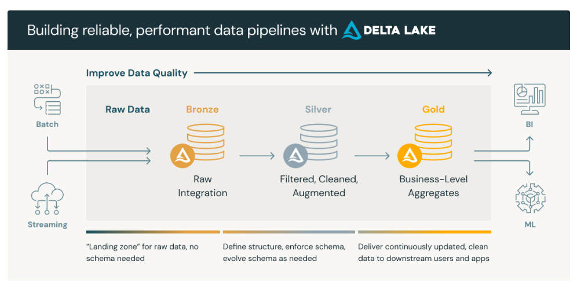

Add X logo here

Welcome to X and the data engineering playbook! The purpose of this pack is to acclimatise you to X's landscape as a data engineer and to help you understand commonly used approaches in data engineering.

## Contents 

X's Structure

The general X structure can be found in Bamboo under people > org chart. The data engineering team meets every two weeks on a Monday afternoon. 

Could ask the team to write a short bio each here. 

[Learning Pathways](#Learning-Pathways)

[Software and tech stack](#Software-and-tech-stack)

[Software development best practice](#Software-development-best-practice)

[Common Architectural patterns in data engineering](#.-Common-Architectural-patterns-in-data-engineering)

## Learning Pathways

### Azure certifications for data engineers

* [Azure Fundamentals](https://learn.microsoft.com/en-us/credentials/certifications/azure-fundamentals/?practice-assessment-type=certification)
* [Data Engineering on Microsoft Azure](https://learn.microsoft.com/en-us/training/courses/dp-203t00)
* [Azure AI Fundamentals](https://learn.microsoft.com/en-us/credentials/certifications/azure-ai-fundamentals/?practice-assessment-type=certification)
* [Azure AI Engineer Associate](https://learn.microsoft.com/en-us/credentials/certifications/azure-ai-engineer/?practice-assessment-type=certification)
* [Fabric Data Engineer Associate](https://learn.microsoft.com/en-us/credentials/certifications/fabric-data-engineer-associate/?practice-assessment-type=certification)

### Databricks certifications for data engineers

* [Data Engineer Associate](https://www.databricks.com/learn/certification/data-engineer-associate)
* [Data Engineer Professional](https://www.databricks.com/learn/certification/data-engineer-professional)
* [Generative AI Engineer Associate](https://www.databricks.com/learn/certification/genai-engineer-associate)

### Palantir

* [Training track for data engineers](https://learn.palantir.com/page/training-track-data-engineer)

## Software and tech stack

Add in any useful resources for new data engineering starters here.

### Languages

As a data engineer you should have a good understanding of python/pyspark and sql/sqpark sql. You should also have a good understanding of [spark](https://www.databricks.com/glossary/what-is-apache-spark) and distributed compute. 

We dont have admin rights on our devices but any apps that you will need should be available in the company portal for download. If an app that you need is not in the company portal then you should contact IT and ask if they can add it.

### Technology

Databricks

Azure Synapse Analytics and ADF

Commonly used Azure components

## x. Software development best practice

### Getting started with git. 

Git is available on the company portal. If you want to use git with vs code you'll need to set it as an environment variable path on your device once you have downloaded it so that vs code can access it. 

### Version control and software development best practice

For data engineers working in cloud infrastructure, version control and software development best practices are essential to ensure reliability, collaboration, and traceability across data pipelines and environments. Using tools like Git and Azure DevOps allows teams to manage changes to infrastructure-as-code, ETL scripts, and data models in a controlled and auditable way. 

Adopting branching strategies, code reviews, and pull requests promotes code quality and knowledge sharing. Automated testing and CI/CD pipelines should be integrated to validate transformations, enforce coding standards, and streamline deployments to cloud environments. Together, these practices reduce errors, improve reproducibility, and enable scalable, maintainable data engineering workflows.

### Test Driven Development

As data engineers we should adopt a test-driven development (TDD) approach whenever possible to ensure that data pipelines, transformations, and models are robust, reliable, and maintainable. By writing tests before implementing code, engineers can define clear expectations for data quality and logic which means catching issues early in development rather than in production. 

TDD encourages modular, reusable code and builds confidence when refactoring or scaling pipelines. It also supports automated validation of schema changes, business rules, and performance assumptions.

### Pull requests

Pull requests are a key part of collaborative development, allowing data engineers to propose changes for review before merging into shared codebases. Protecting the main branch ensures that only tested, reviewed, and approved code is deployed which will prevent accidental overwrites or unverified changes that could disrupt production pipelines. 

During code reviews, engineers should look out for data logic accuracy, adherence to coding and naming standards, performance implications (e.g. inefficient queries or transformations), and test coverage. Reviews also provide an opportunity to share knowledge, maintain consistency across the team, and uphold data quality and reliability standards. 

## x. Common Architectural patterns in data engineering

How the architecture is designed will be based on the clients use case and thier infrastructure they already have in place. The below concepts are to give an overview of commonly used architectural patterns.

### Warehouses, lakes and lakehouses

🔷 Data Warehouse (Structured Analytics)

Azure Synapse Analytics – Microsoft’s flagship cloud data warehouse for large-scale analytics and reporting.

Azure SQL Database – A managed relational database suitable for smaller-scale warehousing or departmental analytics.

Power BI – Often paired with Synapse for visualization and reporting.

💡 Example use case: Curating and modeling clean, structured data from multiple sources into star schemas for BI dashboards.

🔷 Data Lake (Raw, Unprocessed Storage)

Azure Data Lake Storage Gen2 (ADLS Gen2) – A scalable data lake built on top of Azure Blob Storage, ideal for storing raw structured, semi-structured, and unstructured data.

Azure Databricks – Commonly used to process and transform raw data stored in ADLS using Spark.

💡 Example use case: Storing raw IoT logs, CSVs, and JSON files from multiple systems for future transformation and analytics.

🔷 Data Lakehouse (Unified Analytics Platform)

Azure Databricks with Delta Lake – Implements the lakehouse paradigm by combining the flexibility of a data lake with the transactional reliability and query performance of a data warehouse.

Microsoft Fabric (Lakehouse) – A newer, fully integrated lakehouse offering that unifies data engineering, analytics, and BI on top of OneLake.

💡 Example use case: Using Delta tables in Databricks or Fabric’s Lakehouse to enable both SQL-based reporting and machine learning from the same data source.

### Medallion Architecture

The Medallion Architecture is a data design pattern that structures data pipelines into three logical layers - Bronze, Silver, and Gold. The aim of this is to improve data quality, reliability, and reusability across an organisation. This architecture helps data teams manage the gradual refinement of raw data into business-ready insights. Each layer represents a different stage of data curation: Bronze holds raw, unprocessed data ingested from various sources; Silver contains cleaned and conformed data, where schema enforcement, deduplication, and validation occur; and Gold provides fully refined, aggregated, and business-oriented data models optimized for analytics, reporting, and machine learning.

By layering data transformations in this way, the Medallion Architecture promotes modularity, governance, and trust in the data ecosystem. It encourages teams to apply consistent data quality checks and transformation logic at defined points, enabling clear data lineage and simplifying troubleshooting. Additionally, it supports a test-driven and incremental development approach — new logic or data sources can be introduced at the Bronze or Silver layer without disrupting downstream users consuming Gold datasets. The result is a scalable, maintainable framework that supports both operational efficiency and analytical agility in modern data platforms.

[Microsoft: What is the medallion lakehouse architecture?](https://learn.microsoft.com/en-us/azure/databricks/lakehouse/medallion)

